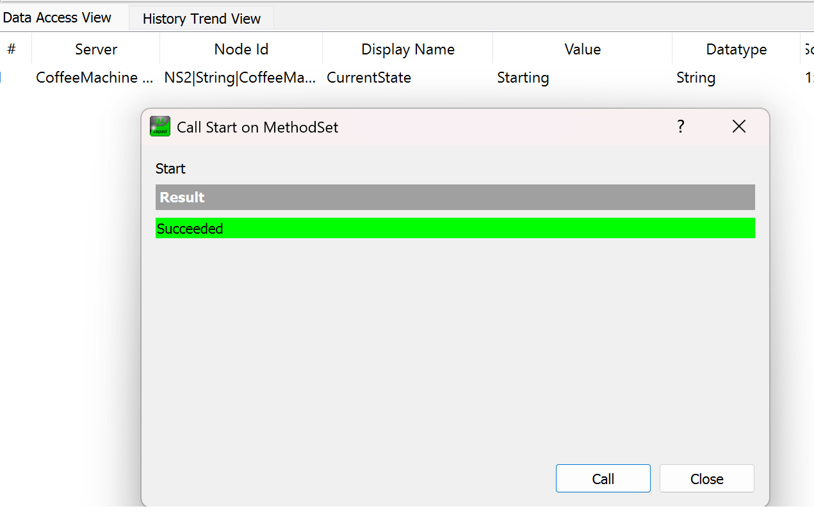
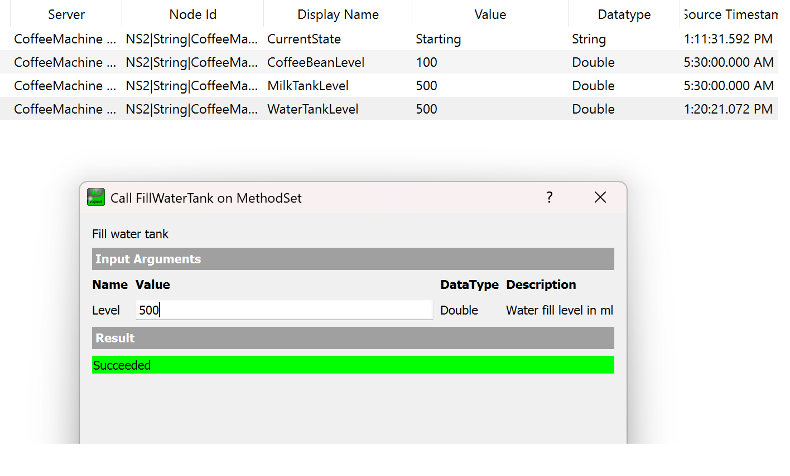
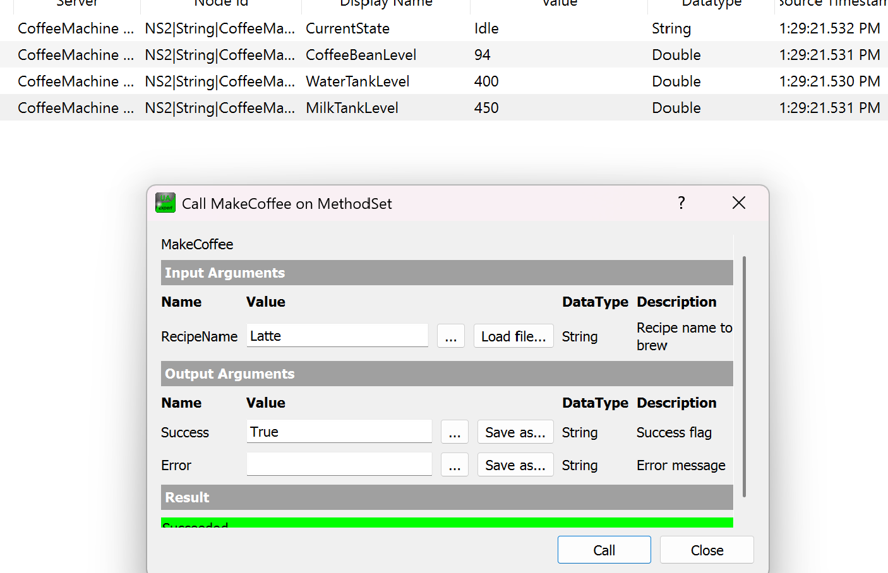
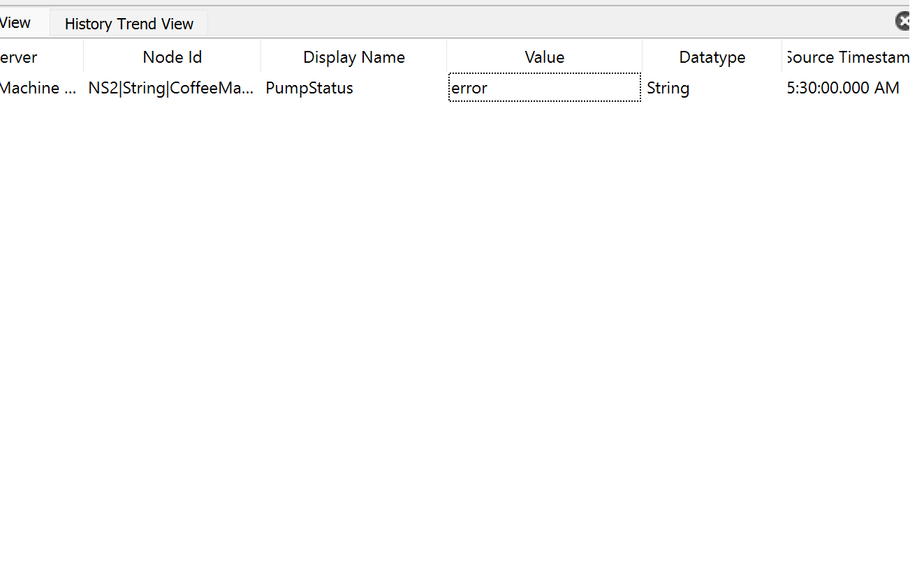
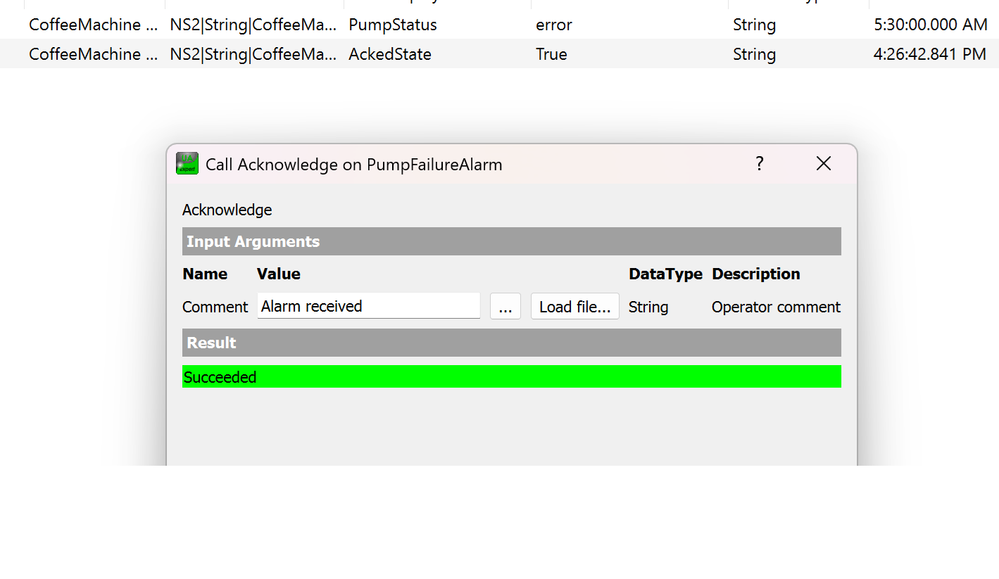
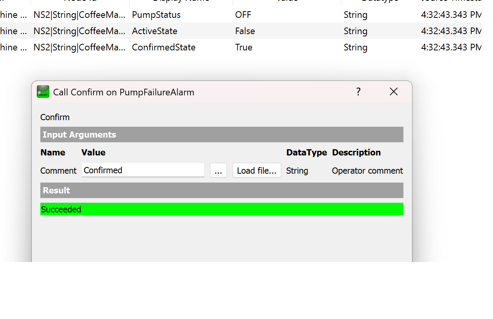
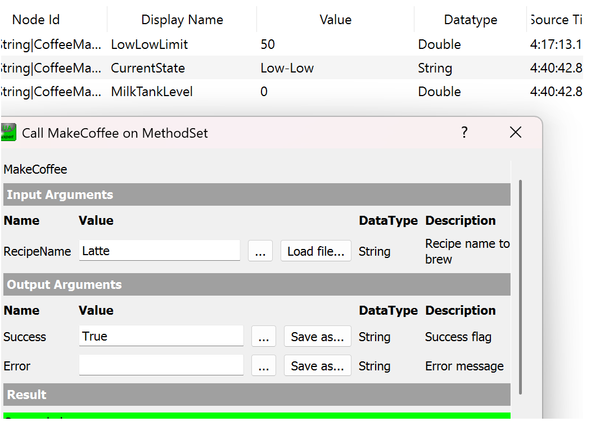

# OPC UA Coffee Machine

## 🚀 Purpose

This project simulates a **coffee machine** with real industrial automation concepts. It serves as a simple demo showcasing how to design a project using the OPC UA information model for industrial IoT applications.
This project includes:

* OPC UA Information Modeling using NodeSet XML
* Python-based OPC UA Server (`asyncua`)
* Methods, Alarms, and Historizing

## 📂 Project Structure

```
OPCUA_coffee_machine/
├── src/                            # Python source code
├── models/
│   └── nodeset/                    # OPC UA NodeSet XML
├── uaexpert/                       # UAExpert project file
│   ├── coffee_machine.uap
│   └── screenshots/
├── data/                           # Historian database (SQLite)
│   └── my_datavalue_history.sql
└── README.md
```


## ⚙️ Prerequisites

- Python 3.8+
- `asyncua` library
- UAExpert (OPC UA Client)

## ▶️ How to Run

1. Start the OPC UA server:

```bash
python src/main.py
```

2. Open **UAExpert**

3. Connect to:

```
opc.tcp://127.0.0.1:4849/coffee/
```

4. Load project file:

```
uaexpert/coffee_machine.uap
```

## 🔧 Node Functionalities

### 🧠 1. DeviceHealth

Represents the overall health of the coffee machine.
Possible values:
 - NORMAL → System is operating correctly
 - WARNING → Minor issue (e.g., low level)
 - ERROR → Critical failure (e.g., pump failure)

### ⚙️ 2. Parameters (Core Machine State)

#### ☕ Resource Levels

 - CoffeeBeanLevel (Double): Current amount of coffee beans available. Used to determine if brewing is possible

 - MilkTankLevel (Double): Current milk level. Triggers MilkTankLevelAlarm when low

 - WaterTankLevel (Double): Current water level. Required for brewing coffee

#### 🔁 Machine Status

 - PumpStatus (String):
    ON / OFF / ERROR
      →  ERROR triggers PumpFailureAlarm

 - HeaterStatus (String):
    ON / OFF
     →  Indicates heating element state


 - GrinderStatus (String):
    ON / OFF
     →  Used during coffee preparation

 - ValveStatus (String):
    OPEN / CLOSED
     →  Controls fluid flow


#### 📊 Process Data

 - ServedCoffeeCount (Int64):
    Total number of coffees served

 - CurrentState (String):
    Machine operational state.
    Possible values:
     - Idle
     - Brewing
     - Running
     - Starting
     - Stopped

### 🏷️ 3. Identification

 - Manufacturer (String): 
    Example: Philips

 - Model (String):
    Example: CM-100

### 📦 4. Batch Information

 - BatchId (String):
    Represents production batch

 - OrderId (String):
    Represents order reference

 - SystemTime (String/DateTime):
    Current system time

### 🚨 5. DeviceHealthAlarms → PumpFailureAlarm

#### 🔴 Alarm States

 - ActiveState (Boolean):
    TRUE → Alarm is active (fault exists)

 - AckedState (Boolean):
    TRUE → Operator acknowledged alarm

 - ConfirmedState (Boolean):
    TRUE → Operator confirmed resolution

 - EnabledState (Boolean):
    TRUE → Alarm monitoring enabled

#### 📢 Alarm Details

 - Message (String):
    Description of alarm, Example: "Pump failure detected"

 - Severity (String):
    Alarm importance, Example: 0 → Normal, 900 → Critical

 - EventId (String):
    Unique identifier for alarm occurrence

 - Time (DateTime):
    Time when alarm occurred

 - ReceiveTime (DateTime):
    Time when server received the event

 - Comment (String):
    Operator remarks

### ⚠️ 6. ErrorConditions → MilkTankLevelAlarm

#### 📉 Limits
    
 - LowLimit (Double): Threshold for low level warning(200ml)

 - LowLowLimit (Double): Critical level threshold(50ml)

#### 🔄 State

 - CurrentState (String): Represents level condition:
     - Normal
     - Low
     - LowLow

### 🍵 7. Recipes

Supported recipes:

 - RecipeName (String):
    Cappuccino
     - Required Ingredients:
       - GroundsAmount (Double):Amount of coffee powder used(12g)
       - GroundsWater (Double): Amount of water used(30ml)
       - MilkAmount (Double): Milk used(100ml)

 - RecipeName (String):
    Latte
     - Required Ingredients:
       - GroundsAmount (Double): 18g
       - GroundsWater (Double): 100ml
       - MilkAmount (Double): 50ml

### ⚙️ 8. Methods (MethodSet)

 - Start: Starts the coffee machine
    
 - Stop: Stops the machine

 - MakeCoffee
     - Input: RecipeName (String)
     - Function:
       - Prepares coffee based on recipe
       - Reduces resource levels
       - Updates ServedCoffeeCount

 - FillWaterTank
     - Input: Level (Double)
     - Function:
       - Refills water tank

 - FillMilkTank
    - Input: Level (Double)
    - Function:
       - Refills milk tank

 - FillCoffeeBean
    - Input: Level (Double)
    - Function:
       - Refills coffee beans

### 📈 9. Historizing

Stores time-series data in SQLite format. Currently supporting:
 - MilkTankLevel
 - WaterTankLevel
 - CoffeeBeanLevel


## ☕ How to Brew Coffee (Demo Flow)

Follow these steps in **UAExpert**:

### 1. Start the Machine

```
Objects → CoffeeMachineA → MethodSet → Start
```



### 2. Check Resource Levels

Ensure:

* WaterTankLevel > required level
* MilkTankLevel > required level
* CoffeeBeanLevel > required level




### 3. Select Recipe

Examples:

```
Latte
Cappuccino
```


### 4. Make Coffee




## 🚨 Pump Failure Alarm (Simulation)

### 1. Go to PumpStatus
```
Objects → CoffeeMachineA → Parameters → PumpStatus
```
### 2. Manually Set Value(Error)



### 4. Acknowledge Alarm



### 5. Confirm Alarm
 - Resets system state

 

## 🚨 Milk Tank Level Alarm (Simulation)
 - Trigger Condition: MilkTankLevel < LowLimit

  

## Future Improvements

 - SCADA dashboard integration
